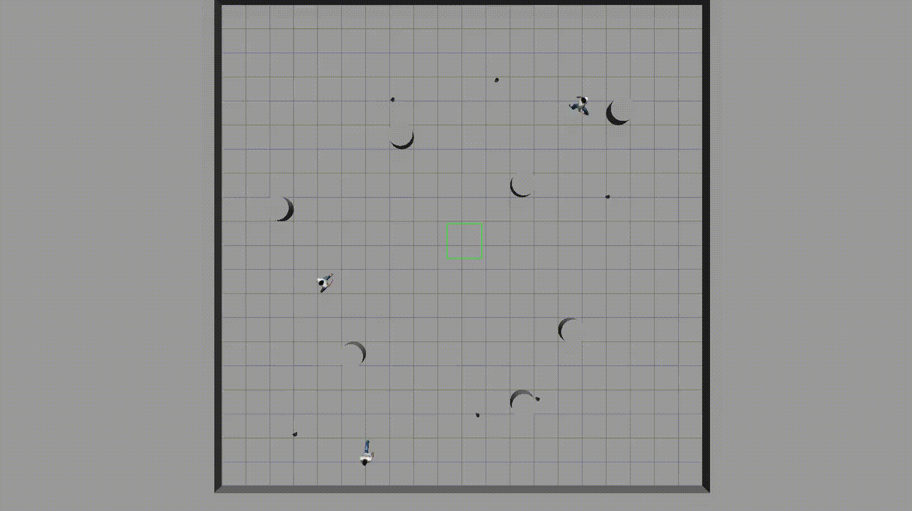

# 🤖 Human-Aware Model Predictive Coverage Control (HMPCC)

This ROS package implements **human-aware model predictive coverage control (HMPCC)** using **Model Predictive Control (MPC)** combined with **human motion prediction**. The system coordinates a team of robots to optimally cover an environment while actively avoiding humans. This package is designed for real-time applications like search-and-rescue, smart surveillance, or service robotics in dynamic, human-populated environments.

Robots plan safe, efficient trajectories using MPC while forecasting human motion to maintain both safety and coverage performance.

---

## 🚀 Features

- 🧠 Human-aware, distributed multi-robot coverage control
- 📈 MPC-based real-time trajectory optimization
- 🕵️ Human motion prediction for proactive avoidance
- 🧩 ROS-native design for modular integration
- 🌍 Simulation-ready (Gazebo & RViz supported)

---

## 📁 Package Structure

<pre> <code>```nonehuman_aware_coverage/
├── config/ # Configuration and tuning parameters
├── launch/ # Launch files for simulation or real robots
├── scripts/ # Human prediction and support tools
├── src/ # Core algorithm implementation
├── urdf/ # Robot description files
├── worlds/ # Custom Gazebo worlds (optional)
├── msg/ # Custom ROS messages (if used)
├── srv/ # Custom services (if used)
├── README.md # This file```</code> </pre>


---

## ⚙️ Dependencies

This package was developed and tested using **ROS Noetic** (Ubuntu 20.04). The following dependencies are required:

### ROS packages:
- `geometry_msgs`
- `nav_msgs`
- `sensor_msgs`
- `tf2_ros`
- `visualization_msgs`
- `roscpp` / `rospy`
- [human_actor_plugin](https://github.com/ARSControl/human_actor_plugin.git) to spawn and move humans in the environment.
- [turtlebot3_simulations](https://github.com/ROBOTIS-GIT/turtlebot3_simulations.git) to use TurtleBot3 robots.

### External libraries:
- [CasADi](https://web.casadi.org/) for solving nonlinear MPC problems
- `scipy`, `numpy`, `matplotlib` for human prediction modules
- [Gazebo](http://gazebosim.org/) and RViz for simulation and visualization


### 📦 Installation
```bash
# Clone into your catkin workspace
cd ~/catkin_ws/src
git clone https://github.com/ARSControl/hmpcc.git

# Build the workspace
cd ~/catkin_ws
catkin build

# Source the workspace
source devel/setup.bash
```

### 🧠 How It Works
Each robot in the team executes the following pipeline:

1. Receive human position estimates from sensors or simulation.

2. Predict future human trajectories using motion models.

3. Solve an MPC problem to generate a safe, efficient path:

4. Maximize coverage utility

5. Avoid predicted human locations

6. Respect robot dynamics and collision constraints

7. Execute the trajectory and repeat at each control cycle.

The system supports centralized or decentralized coordination, depending on communication constraints.

### 📡 Inputs
- Robot positions (e.g., from tf or odometry)

- Human positions (from simulation or perception system)

- Environment map (optional)

- Robot configuration (sensor range, dynamics, etc.)

### 🎯 Outputs
- Safe, optimized control commands for each robot

- Trajectory visualizations in RViz

- Optionally, logs for evaluation or offline analysis

### 🧪 Running the Simulation
Launch the default multi-robot coverage simulation with humans:

```bash
roslaunch hmpcc sim_bringup.launch
roslaunch hmpcc multirobot_control.launch
```
This will:

- Spawn robots and human agents in a Gazebo world

- Launch the coverage control MPC node for each robot

- Start RViz for visualization


#### Launch Arguments
| Argument           | Description                          | Default             |
| ------------------ | ------------------------------------ | ------------------- |
| `world_name`       | Gazebo world file                    | `myworld.world`     |
| `v_max`            | Max linear velocity                  | `0.3`               |
| `w_max`            | Max angular velocity                 | `0.5`               |

## 📈 Example Results
Below are example behaviors observed in simulation:

- Robots spread out to cover high-priority areas.

- When humans enter the field, robots modify their paths to avoid collisions.

- Smooth, real-time replanning observed under dynamic human motion.



### 📄 Publications & References
This package is based on concepts from:

``` bibtex
@article{catellani2025hmpcc,
  title={HMPCC: Human-Aware Model Predictive Coverage Control},
  author={Mattia Catellani, Marta Gabbi, Lorenzo Sabattini},
  journal={IEEE International Symposium on Multi-Robot & Multi-Agent Systems (MRS)},
  year={2025}
}
```

### 🤝 Contributing
Contributions are welcome! To contribute:

1. Fork this repository

2. Create a new feature branch (git checkout -b feature-name)

3. Commit your changes

4. Push and create a pull request

Please open an issue for any bugs or feature requests.

### 📬 Contact
Author: Mattia Catellani

Email: mattia.catellani@unimore.it

Website: https://www.arscontrol.unimore.it/mattia-catellani/

### 📜 License
This project is licensed under the MIT License. See the LICENSE file for more details.
